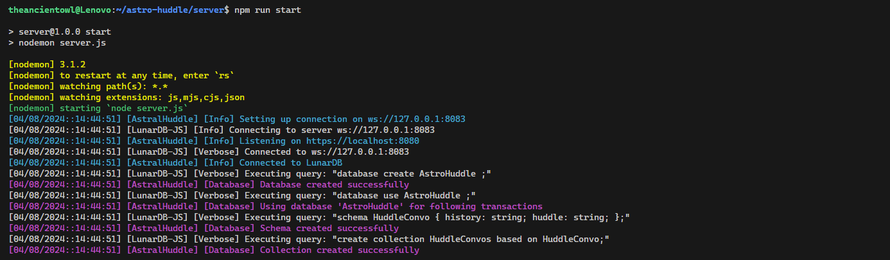

# 1. How to run

### 1.1. Download and Run [LunarDB Server](https://github.com/TheAncientOwl/lunardb/releases).

```
wget https://github.com/TheAncientOwl/lunardb/releases/download/v1.0.0/lunardb_server_linux-v1.0.0.elf64
chmod +x lunardb_server_linux-v1.0.0.elf64
./lunardb_server_linux-v1.0.0.elf64
# Server logs: in separate terminal, same path as where lunardb_server_linux-v1.0.0.elf64 was run
tail -f lunardb/logs/lunardb.log
```


### 1.2. Setup AstroHuddle backend project

```
$ git clone https://github.com/TheAncientOwl/astro-huddle.git
$ cd astro-huddle/server
$ npm install
$ npm run start
```

#### 1.2.1. _AstroHuddle ~ Initial Server Logs_



#### 1.2.2. _LunarDB Server ~ AstroHuddle Logs_


### 1.3. Open `astro-huddle/client/index.html` in 2 clients

#### 1.3.1 Gallery


<p></p>


# 2. Project resources

<p>
    <a href='https://github.com/TheAncientOwl/lunardb'>🌙 LunarDB</a></br>
    <a href='https://github.com/TheAncientOwl/lunardb/blob/main/Products.md'>💻 CLI / 🌐 Server</a></br>
    <a href='https://github.com/TheAncientOwl/lunardb-js'>✨ LunarDB-JS</a></br>
</p>
